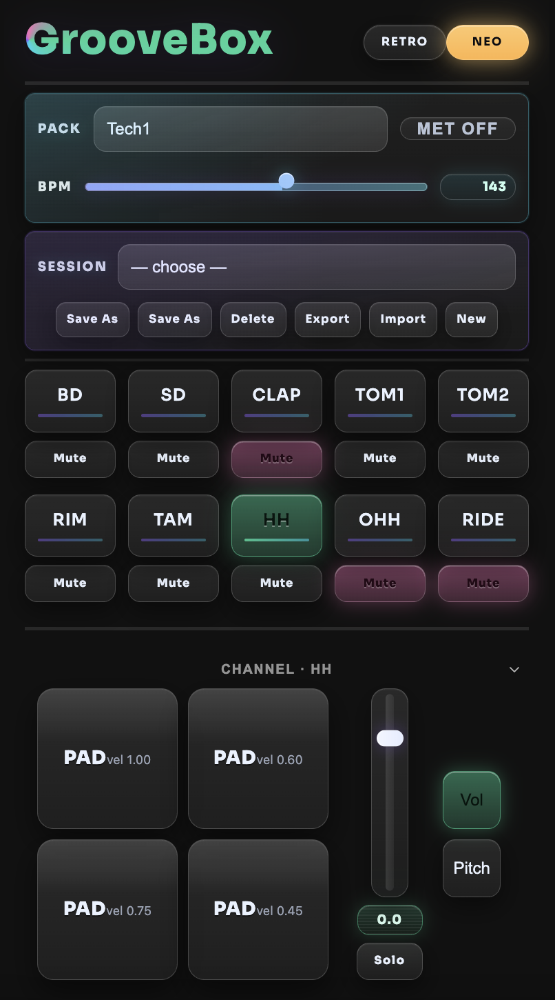
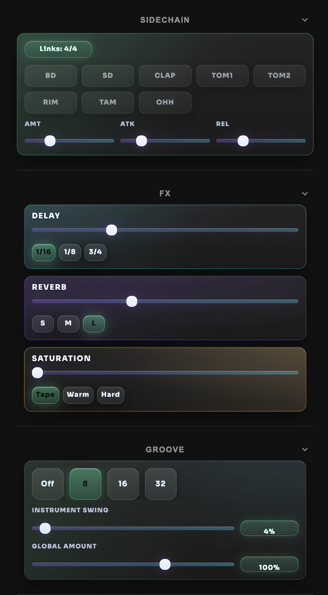
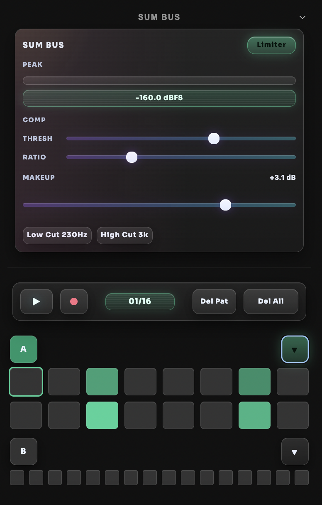

# GrooveBox — Mobile‑First Drum Computer (React + Web Audio)


> A tap‑friendly, mobile‑first groovebox for the browser. Pick a pack, tap pads, record patterns, swing the feel, add delay/reverb/saturation, set up sidechain ducking, and manage sessions — all on mobile or desktop.  
> **Stack:** React, Vite, Web Audio API, `localStorage` (+ `sessionStorage` where appropriate).

|  |  |  |
|---|---|---|

---

## Tech Stack

|  | Tech | Purpose |
|---|---|---|
|  | **React 18** | UI, stateful components, mobile-first interactions |
|  | **Vite** | Dev server, HMR, fast builds, glob imports for presets |
|  | **Web Audio API** | Audio engine: voices, choke, ducking, delay, reverb (IR), saturation, metronome |
|  | **JavaScript (ES Modules)** | App logic, scheduler, gesture handling, storage utilities |
|  | **Node.js (LTS)** | Tooling runtime for dev/build via Vite |
|  | **CSS3** | Theming (RETRO/NEO), layout, tap-safe sizing (≥16px), motion/utility classes |
|  | **HTML5** | Semantic structure, accessibility attributes (e.g., `aria-pressed`) |
|  | **Web Storage API** | `localStorage` (sessions/theme) + `sessionStorage` (short-term UI) |
|  | **File & Blob APIs** | JSON **Export/Import** for backups (`Blob`, `URL`, `FileReader`) |
|  | **Rollup (via Vite)** | Production bundling & code splitting |
|  | **npm** | Dependency management & project scripts |


## A Kind Note on Collaboration

I’m keeping this project **All Rights Reserved** for now — but I truly love collaborating.  
If you’d like to reuse parts, contribute, or explore a joint direction, please reach out first so we can find the best way to work together. 💌

- Open an issue titled _“Collab request”_ and tell me what you have in mind.

- Happy to chat about licenses for specific use cases, contributions, or forks.

Thank you for the kindness and for asking first. 🙏

---

## What You Can Do

- **Play immediately** with a mobile‑first interface (tap‑safe controls, scroll‑friendly gestures, no accidental zoom).
- **Shape sound** per instrument: **volume/mute**, **pitch**, **saturation** (Tape/Warm/Hard).
- **Send to FX** per instrument: tempo‑synced **Delay** (1/16, 1/8, 3/4) and **Reverb** (S/M/L).
- **Polish the mix** on the **Sum Bus**: compressor → (optional) limiter → makeup; optional **low/high cuts**; live **peak meter**.
- **Feel the groove**: per‑instrument swing (none/8/16/32) + global swing %; metronome (4 beats / all 16ths / off).
- **Choke groups** (e.g., closed HH chokes open HH) and **sidechain ducking** per trigger/target with amount + attack/release.
- **Sessions & presets**: auto‑save, Save/Load/Delete, **Import/Export as JSON** for easy backups.
- **Themes**: RETRO and NEO, persisted via `localStorage` (`gb-scheme`).

---

## Getting Started (Local)

If you’d like to try GrooveBox on your machine, here’s the easiest path:

1. **Prereqs:** Node.js 18+ (or a current LTS).  
2. **Grab the code:** clone this repo or download it as a zip.  
3. **Install deps:**  
   ```bash
   npm install
   ```
4. **Run the dev server:**  
   ```bash
   npm run dev
   ```
   Vite will print a local URL (often `http://localhost:5173`). Open it in your browser.
5. **(Optional) Build for production:**  
   ```bash
   npm run build
   npm run preview
   ```


---

## Quick Tour

1. **Sound unlock:** If prompted, tap **Continue** on the SoundGate, then hit **Play**.  
2. **Packs & tempo:** Choose a **Sample Pack**, set **BPM**, and tap the **Metronome** to cycle modes.  
3. **Pads:** In **Channel**, tap pads to audition.  
   - **Record:** press **Record** then **Play**; taps are written to the 16‑step grid.  
4. **Steps:** Use the **Step Editor** to toggle steps (rows A/B), expand rows, and cycle step velocities.  
5. **Mix:** **Solo**, **Volume**, and **Pitch** per instrument.  
6. **FX:** Dial in **Delay**, **Reverb**, and **Saturation** per instrument (plus mode switches).  
7. **Swing:** Per‑instrument swing type/amount + **Global %** for overall feel.  
8. **Sidechain:** Select which instruments duck others; set dB, attack, release.  
9. **Sum Bus:** Compressor, optional limiter, makeup gain, and gentle HP/LP filters; watch the live meter.  
10. **Sessions:** Save/Load/Delete, **Export** current state to JSON, **Import** a saved groove.  
11. **Themes:** Toggle **RETRO/NEO** in the header.  
12. **Panic refresh:** Tap the **GrooveBox** wordmark to perform a safe, cache‑busting hard refresh (sessions are preserved).

---

## Persistence & Backups

- The current working state is auto‑saved to the browser (primarily `localStorage`; `sessionStorage` can be used for short‑lived UI bits).  
- Named sessions are stored in a dictionary and can be **Exported**/**Imported** as prettified JSON files — perfect for backups or sharing.  
- Where supported, the app politely requests **persistent storage** once to reduce accidental data eviction by the browser.

---

## How It’s Put Together (High‑Level)

- **Web Audio graph**
  - Per‑instrument voices → saturation insert → sidechain duck chain → post gain/mute → FX sends (Delay/Reverb) → Master.
  - Master flows through an **Analyser**, optional **HP/LP** filters, **Compressor**, optional **Limiter**, and **Makeup** gain.
- **Timing & scheduling**
  - A small look‑ahead scheduler aligns events to `AudioContext.currentTime` with BPM‑aware step duration.
- **Swing**
  - Per‑instrument type (none/8/16/32) and amount, combined with a global swing % to compute precise time offsets.
- **Choke & sidechain**
  - Choke groups (e.g., HH → OHH) and per‑trigger duck envelopes (exp ramps with amount/attack/release).  
- **UI & DX**
  - `useTapGesture` guards against ghost clicks and preserves natural scrolling on mobile. Two themes set via `data-scheme`.

---

## Directory Sketch

```
src/
  App.jsx, main.jsx, App.css
  GrooveBox.jsx                 # Main orchestrator & UI sections
  components/
    header/PackBar.jsx
    header/SessionBar.jsx
    Channel.jsx
    InstrumentGrid.jsx
    panels/{FXPanel,SidechainPanel,SwingPanel,SumBusPanel}.jsx
    ui/FoldSection.jsx
    PadButton.jsx
    StepEditor.jsx
  constants/
    instruments.js              # INSTRUMENTS, CHOKE_GROUPS
    packs.js                    # SAMPLE_PACKS, PACK_IDS
    sequencer.js                # PPQ, STEPS_PER_BAR, etc.
    session.js                  # keys & version
  engine/
    useAudioEngine.js           # Web Audio: graph, FX, ducking, choke, click
    unlockAudio.js
  hooks/
    useTapGesture.js
    useDisableZoomKeepScroll.js
    useNoHorizontalWheel.js
  session/
    useSessions.js              # save/load/export/import + presets
  presets/
    *.json                      # bundled read-only sessions
  styles/
    theme-base.css
    theme-retro.css
    theme-neo.css
```

---

## License (All Rights Reserved)

**Copyright © 2025 Lee. All Rights Reserved.**

This repository and its contents are not licensed for public use, copying, modification, or redistribution without prior written permission from the author.

I’m happy to discuss collaboration, contributions, special permissions, or tailored licenses.  
Please open an issue titled **“Collab request”** with a short note about your ideas and intended use.  
Thank you for understanding — Looking fwd!
